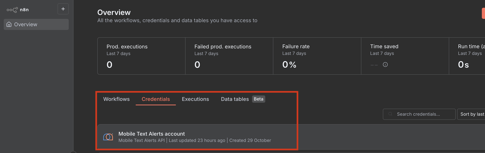

# @mobiletextalerts/n8n-nodes-mta-mcp

This is an n8n community node. It lets you use the Mobile Text Alerts MCP server in your n8n workflows.

Use Mobile Text Alerts to send text messages, manage your subscriber lists and automate your messaging workflows.

[n8n](https://n8n.io/) is a [fair-code licensed](https://docs.n8n.io/sustainable-use-license/) workflow automation platform.

[Installation](#installation) [Operations](#operations) [Credentials](#credentials) [Compatibility](#compatibility) [Usage](#usage) [Resources](#resources) [Version history](#version-history)

## Installation

Follow the [installation guide](https://docs.n8n.io/integrations/community-nodes/installation/) in the n8n community nodes documentation.

## Operations

- **Send a Message**: Send a message immediately via Mobile Text Alerts API. Use this tool for messages that need to be sent right away. For scheduling messages to be sent at a future time, use the Schedule Message tool instead.
- **Schedule a Message**: Schedule a message to be sent at a specific time in the future via Mobile Text Alerts API. Use this tool when you need to send a message at a later date/time rather than immediately.
- **Add Subscribers**: Add or update your subscribers in bulk.
- **Create a Group**: Create a regular or adaptive group in Mobile Text Alerts.

## Credentials

First, get a Mobile Text Alerts API key: [https://developers.mobile-text-alerts.com/getting-started/get-an-api-key](https://developers.mobile-text-alerts.com/getting-started/get-an-api-key)

1. Visit Settings for your account. This is under the three-dot menu in the top right of the platform dashboard.
2. Select the Developer tab or scroll down to Developer Resources.
3. Click the GENERATE A NEW KEY button. Enter a name for the new API Key.

Next, configure your Mobile Text Alerts API key in the n8n credentials section under "Mobile Text Alerts account".

## Compatibility

This node has been tested with n8n version 1.117.3.

## Resources

- [n8n community nodes documentation](https://docs.n8n.io/integrations/#community-nodes)
- [Mobile Text Alerts API documentation](https://docs.mobile-text-alerts.com/)
